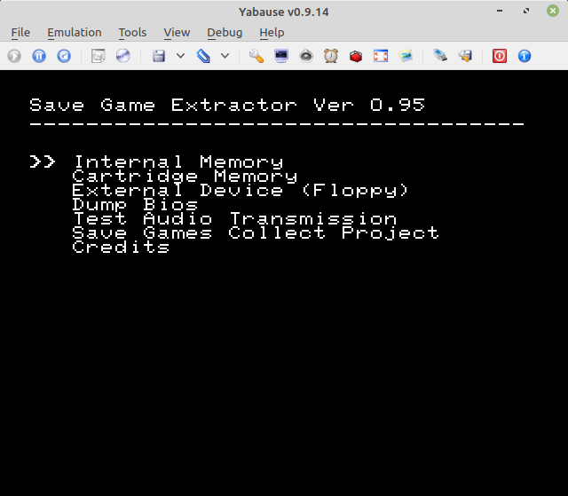
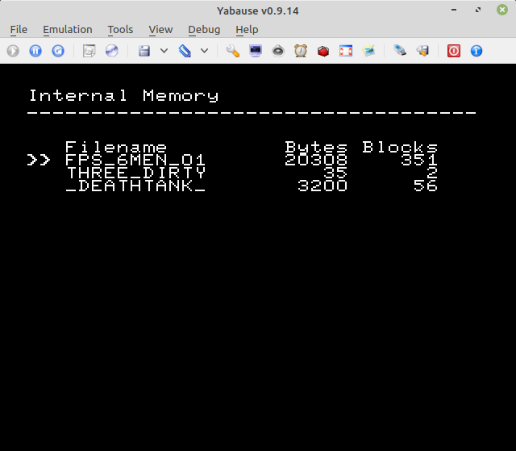
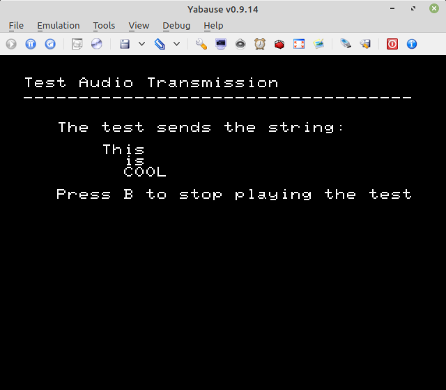
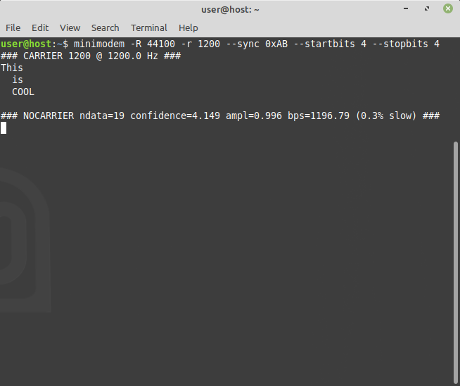

# Save Game Extractor (SGEX)
Transmit Sega Saturn save game files as audio to backup on a PC. Based on the amazing [minimodem](https://github.com/kamalmostafa/minimodem). Currently transfer speeds are ~70 bits/second. Build with [Jo Engine](https://github.com/johannes-fetz/joengine) or download an ISO from [releases](https://github.com/slinga-homebrew/Save-Game-Extractor/releases).

## Demo Video
[Demo Video](https://github.com/slinga-homebrew/Save-Game-Extractor/blob/master/screenshots/demo.mkv)

## Screenshots

## Comparision to Other Game Save Transfer Methods
SGEX is not the only method to backup Sega Saturn save games. SGEX has the advantage that it is cheap (costs a burned CD + stereo audio Y cable adapter), easily available, and supports extracting saves directly from a backup cartridge. The drawbacks are it's speed and that it requires a method to boot burned discs.

| | Cheap and Easily Available | Supports Backup Cartridge | Fast | Doesn't Require Additional Jailbreak | Notes |
| --------------- | --------------- | --------------- | --------------- | --------------- | --------------- |
| SGEX | Yes | Yes | No | No | N/A |
| [Save Game Manager](http://www.rockin-b.de/saturn-savegamemanager.html) | Yes | Yes | No | No | Another software only solution, SGM is an ISO you boot on your system to manage your saves. It's main purpose is to copy burned saves to your Saturn, but it has features for exporting saves via hex code. For very small files this would work, but for larger files SGEX is the superious option. I recommend using SGEX to get your saves off of the Saturn and using SGM to copy your saves back on. |
| [NetLink](https://segaretro.org/NetLink_Internet_Modem) | No | No | Yes | Yes | It's a modem. It's most likely a pain but you could probably figure out a way to e-mail yourself saves from the internal memory. As it takes up the cartridge slot you obviously can't directly dump cartridge saves. |
| [Saturn Floppy Drive](https://segaretro.org/Saturn_Floppy_Drive) | No | Yes | Yes | Yes | Saturn FDD is great except PCs can't read their disks. You can use SGEX to transfer your FDD saves to PC. Also, the FDD is $200-$300 on eBay. |
| [Saturn Gamer's Cartridge](https://ppcenter.webou.net/satcart/#gamers) | No | No | Yes | Yes | Gamer's Cart is amazing but no longer being made. Has an SD slot to transfer saves.  As it takes up the cartridge slot you obviously can't directly dump cartridge saves. |
| [Satiator ODE](https://www.patreon.com/prof_abrasive) | No | Yes | Yes | Yes | Not released yet, but the Satiator is rumored to supported backing up saves to the ODE. Should support dumping saves from cartridges. Hopefully will be released at a reasonable price. |
| [Action Replay](https://segaretro.org/Action_Replay) | No | No | Yes | Yes | Certain models of the Action Replay have a 25-pin DSUB connector on top. Homebrew has been written to copy data including saves from that port. As it takes up the cartridge slot you obviously can't directly dump cartridge saves.|

## Usage
* Connect the stereo out of your Saturn to the line in of your PC. Use a [Y-Cable Headphone Jack to RCA](https://www.amazon.com/StarTech-com-6in-Stereo-Audio-Y-Cable/dp/B000A88L9E/) or something similar.
* Burn the SGEX ISO to disc and boot on your Saturn
* Run minimodem on your PC in receive mode: minimodem -R 44100 -r 1200 --sync 0xAB --stopbits 4 --startbits 4
* Within Save Game Extractor on your Saturn select the "Test Audio Transmission" option
    * Hit C to transmit audio

* You should see the test message come across your screen:

* Save a file with: minimodem -R 44100 -r 1200 --sync 0xAB --stopbits 4 --startbits 4 > mysave.bin
* On the Saturn, select the location of your save (Internal Memory, Cartridge Memory, or External Memory). Select the save file you wish to transfer. Press C to transfer

* When your transfer is complete, stop the minimodem process
* Run the Python script on the transmitted data: python sgex.py mysave.bin
    * The script should create the save game based on the transmitted data

## Frequently Asked Questions
* Can I copy saves from a backup cartridge? Answer: yes.
* Now that I have my save backed up, how do I get it back to my Saturn? You can burn the save game to disc using my [Save Game Copier](https://github.com/slinga-homebrew/Save-Game-Copier) or Rockin-B's much better [Save Game Manager](http://www.rockin-b.de/saturn-savegamemanager.html). These utilities will let you copy the save file from a burned disc back to the Saturn.
* Can I dump my Saturn BIOS using this? Answer: While I added an option to do that, the transfer speeds are just too slow. The BIOS is 512k so it will take ~19 hours to transfer. I don't recommend trying at the current moment.
* Can I just record the audio on my phone and have minimodem decode the recording? Answer: You can try but it's unlikely to give you good results. I imagine the noise would be too high.

## Improving Throughput
With significant work it should be possible to increase the throughput. These are the main areas I've looked at:
* I'm currently buffering the audio, playing the audio, and then polling until the audio is finished playing. I do this for every 128 bytes instead of continuously playing audio. This will require significant refactoring.
* The Saturn supports up to 4 PCM channels but minimodem only supports one. I could probably increase the throughput sending data on multiple audio channels and then splitting it back out before decoding it.
* The default Reed Solomon parameters are overkill for the number of expected bit flips. Tweaking the RS parameters seemed painful so I didn't want to deal with it.
* The Saturn has dual CPUs, I'm using only one of them.

## Issues
* Throughput needs to be improved as mentioned.
* Only tested on Linux. Should work on other platforms provided you can run minimodem.
* The transmission buffer is escaped after being Reed Solomon encoded. This means that if 1) an escape character is corrupted or 2) a character is flipped into the escape character the unescape function will fail and Reed Solomon won't be able to recover. The correct solution is to modify Reed Solomon to not use all 255 bits but this seems like a real pain with the library I chose to use.
* Reliability is much worse when using emulators. I'm seeing the addition of bytes of data which is corrupting the transfer. This does not happen on real hardware.
* I don't have a way to detect if Cartridge Memory or External Memory is mounted without calling jo_mount_device(). Unfortunatly jo_mount_device() results in a jo_core_error() if the device is not mounted. This is an issue because I'm currently releasing the code as a debug build. Once I feel the codebase is stable I will cut a release build.
* SGEX uses a lot of heap memory and makes a number of buffer copies. This will require refactoring to improve. I can also look into using DMA copies.
* I capped the maximum number of saves to list at 50. I can adjust that number is needed
* The maximum save file is capped at 128k. This can be adjusted.

## Receiving Dependencies
* Python
* ReedSolo (pip install --upgrade reedsolo)
* minimodem (apt-get install minimodem)

## Compiling Source Code
After installing [Jo Engine](https://github.com/johannes-fetz/joengine), compile with ./compile.

## License
Licensed under GPL3 to comply with the minimodem license.

## 3rd Party Code
Save Game Extractor uses code from:
* [minimodem](https://github.com/kamalmostafa/minimodem) - GPL
* [Jo Engine](https://github.com/johannes-fetz/joengine) - MIT
* [68k](https://github.com/ponut64/68k) - MIT
* [MD5](http://openwall.info/wiki/people/solar/software/public-domain-source-code/md5) - BSD
* [libcorrect](https://github.com/quiet/libcorrect) - BSD
* [miniz](https://github.com/richgel999/miniz) - MIT

## Saturn Save Games Collect Project
Want to share your save games on the web? Send them to the [Save Games Collect](https://ppcenter.webou.net/pskai/savedata/) project. Made by Cafe-Alpha, the author of the Gamer's Cartridge.

## Credits
Special thanks to Antime, Ponut, VBT, and everyone else at SegaXtreme keeping the Saturn dev. Thank you to Takashi for the original Save Game Copier idea back in ~2002.

Thank you to all the great fan translation projects in the works. Helping them was the goal of this project.
